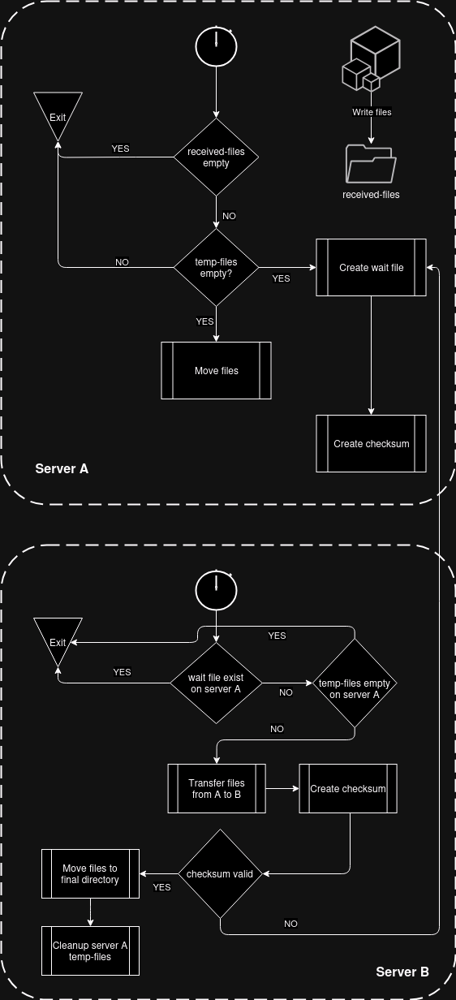

# VxFlow
Streamlining File Transfers with VxFlow: A Simple Solution for Secure and Automated File Management

VXFlow is a lightweight file transfer workflow designed to automate and securely transfer files between two servers while maintaining data integrity. It uses Bash scripts to manage file transfers, validate data integrity with checksums, and handle errors gracefully. For a detailed explanation of how VXFlow works, visit [www.vbutnaru.ro](https://vbutnaru.ro/posts/VxFlow/)

Follow the steps below to set up the scripts on Server-A and Server-B



## Prerequisites

* SSH access is required from Server-B to Server-A (one-way).
* Ensure the required directories and log files exist on both servers.
* Use absolute paths for all directory and file definitions.

## Setup Instructions

### Server-A Script Setup

1. Clone the Repository:

```
git clone https://github.com/vbutnaru/VxFlow.git
cd VxFlow
```

2. Update Variables: Open the server-a.sh script and modify the following variables with absolute paths:

```
SOURCE_DIR_A="received-files"    # Directory from which files will be copied
DEST_DIR_A="temp-files"          # Temporary directory on Server A
LOG_FILE="/var/log/vxflow-server-a.log"  # Log file path for Server A script

# Server names used for logging
SERVER_A_ID="Server A"
SERVER_B_ID="Server B"

```

3. Set Up Cronjob: Add the script to the crontab to run every minute:

```
crontab -e
```

Add the following line to the crontab file:

```
* * * * * /bin/bash <absolute-path-to-vxflow-server-a-script> >> /var/log/vxflow-server-a_debug.log 2>&1
```

### Server-B Script Setup

1. Update Variables: Open the server-b.sh script and modify the following variables with absolute paths:

```
SOURCE_DIR_A="temp-files"         # Temporary directory path on Server A
DEST_DIR_B="temp-input-files"     # Temporary directory path on Server B
FINAL_DIR_B="input-files"         # Final directory on Server B
SERVER_A_SCR_PATH="server-a.sh"   # Server A script path
LOG_FILE="/var/log/vxflow-server-b.log"  # Log file path for Server B script

# SSH configuration for accessing Server A
SSH_KEY="/opt/.ssh/ubuntu-testing-key"  # Path to SSH private key
SSH_USER_ADDRESS="user@server_a"        # Username and address of Server A
SSH_PORT="22"                           # SSH port for Server A

# Server names used for logging
SERVER_A_ID="Server A"
SERVER_B_ID="Server B"
```

2. Set Up Cronjob: Add the script to the crontab to run every minute:

```
crontab -e
```

Add the following line to the crontab file:

```
* * * * * /bin/bash <absolute-path-to-vxflow-server-b-script> >> /var/log/vxflow-server-b_debug.log 2>&1
```

## Logging

* Logs for Server-A are stored in: /var/log/vxflow-server-a.log
* Logs for Server-B are stored in: /var/log/vxflow-server-b.log
* Debug logs (if enabled in cronjobs) are appended to:
- /var/log/vxflow-server-a_debug.log
- /var/log/vxflow-server-b_debug.log

Ensure these paths are writable by the user running the scripts.